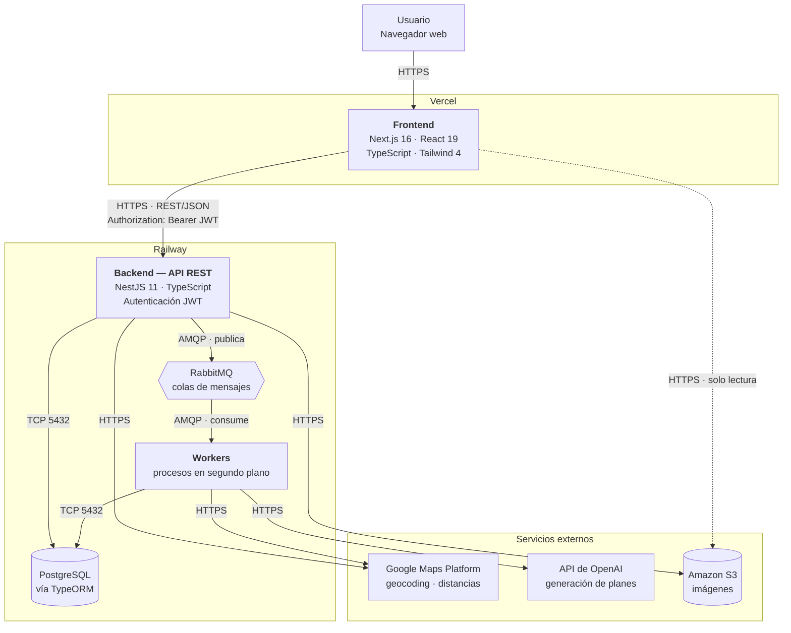

# SmartPlan — Arquitectura del sistema

> Núcleo compartido. Este archivo es idéntico en `SmartPlan-front` y `SmartPlan-back`.
> Si lo modificás, replicá el cambio en el otro repositorio.

## Tipo de aplicativo

**Aplicación web responsive.** No hay app móvil nativa ni híbrida: se accede desde
el navegador, tanto de escritorio como de celular.

Es coherente con el objetivo general definitivo, que habla de "desarrollar una
aplicación web", y con el stack elegido (Next.js del lado del cliente, API REST
del lado del servidor).

## Diagrama

> La línea punteada del frontend a S3 marca que es un acceso secundario (lectura
> de imágenes), no parte del camino principal de la aplicación.

## Componentes y tecnologías

| Componente | Lenguaje | Framework / motor | Responsabilidad |
|---|---|---|---|
| Frontend | TypeScript 5 | Next.js 16 (App Router), React 19, Tailwind CSS 4 | Interfaz de usuario, renderizado, consumo de la API |
| Backend | TypeScript 5.7 | NestJS 11 | API REST, reglas de negocio, autenticación y autorización |
| Base de datos | SQL | PostgreSQL (ORM: TypeORM 0.3, driver `pg`) | Persistencia de las ~30 entidades del dominio |
| Cola de mensajes | — | RabbitMQ | Desacopla el procesamiento asíncrono de la respuesta HTTP |
| Workers | TypeScript | NestJS (consumidores) | Tareas en segundo plano y programadas |
| Almacenamiento de objetos | — | Amazon S3 | Imágenes de actividades y lugares |
| Geolocalización | — | Google Maps Platform | Direcciones, coordenadas y distancias entre actividades |
| Generación de planes | — | API de OpenAI | Armado de planes personalizados y sugerencias |

## Comunicación entre componentes

| Origen | Destino | Protocolo | Detalle |
|---|---|---|---|
| Navegador | Frontend | HTTPS | Renderizado de la aplicación |
| Frontend | Backend | HTTPS, REST/JSON | Token JWT en `Authorization: Bearer <token>` |
| Backend | PostgreSQL | TCP 5432 | A través de TypeORM; nunca SQL crudo desde el controller |
| Backend | RabbitMQ | AMQP | Publica trabajos; responde al cliente sin esperar |
| RabbitMQ | Workers | AMQP | Los workers consumen y procesan |
| Backend / Workers | Google Maps | HTTPS REST | API key por variable de entorno |
| Workers | OpenAI | HTTPS REST | API key por variable de entorno |
| Backend | S3 | HTTPS | Subida de imágenes |
| Frontend | S3 | HTTPS | Lectura directa de imágenes |

**Regla de dependencias:** el frontend nunca habla con la base de datos, ni con
RabbitMQ, ni con OpenAI. Todo lo que necesite pasa por la API del backend. La
única excepción es la lectura de imágenes desde S3.

## Procesamiento asíncrono

Lo que va por cola en lugar de resolverse dentro del request HTTP:

| Proceso | Disparador | Por qué es asíncrono |
|---|---|---|
| Generación de planes (consultas a Google Maps y OpenAI) | El usuario pide un plan (CU17, CU19, CU31) | Depende de APIs externas con latencia variable |
| Envío de notificationes | Eventos del sistema | No debe bloquear la operación que lo origina |
| Actualización de datos externos de actividades y lugares | Tarea programada (CU50) | Volumen alto, sin usuario esperando |
| Limpieza de datos temporales y planes expirados | Tarea programada | Mantenimiento |
| Generación de reportes internos de uso | Tarea programada (CU58) | Agregaciones pesadas |

## Entornos

### Desarrollo — `localhost`

| Componente | Dónde corre | Puerto |
|---|---|---|
| Frontend | `pnpm dev` | 3000 |
| Backend | `pnpm start:dev` | 3001 |
| PostgreSQL | Docker o instalación local | 5432 |
| RabbitMQ | Docker | 5672 (panel: 15672) |
| Google Maps / OpenAI / S3 | Servicios reales, con credenciales de desarrollo | — |

> **Ojo con el puerto del backend.** Next.js y NestJS usan 3000 por defecto los
> dos. Hay que fijar el del backend explícitamente en `main.ts` (o por variable de
> entorno) para que no choquen al levantarlos juntos.

### Producción

| Componente | Plataforma | Costo anual (según Etapa 3) |
|---|---|---|
| Frontend | Vercel | US$ 0 |
| Backend + PostgreSQL | Railway | US$ 240 |
| Google Maps Platform | Google Cloud | US$ 0 |
| API de OpenAI | OpenAI | US$ 120 |
| Dominio | Registrador | US$ 6 |

Total de infraestructura: **US$ 366 / año**.

El despliegue es continuo desde GitHub: Vercel y Railway toman los cambios
mergeados. `main` es la rama de producción.

## Configuración por entorno

Todo lo que cambia entre entornos va por **variables de entorno**, nunca
hardcodeado:

| Variable | Dónde | Qué es |
|---|---|---|
| `NEXT_PUBLIC_API_URL` | Frontend | URL base de la API |
| `DATABASE_URL` | Backend | Conexión a PostgreSQL |
| `JWT_SECRET` | Backend | Secreto de firma del token |
| `RABBITMQ_URL` | Backend / Workers | Conexión a la cola |
| `GOOGLE_MAPS_API_KEY` | Backend / Workers | Clave de Google Maps |
| `OPENAI_API_KEY` | Workers | Clave de OpenAI |
| `AWS_*` | Backend | Credenciales de S3 |

`.env` no se commitea. Mantené un `.env.example` con las claves y sin valores.

## Estado de implementación

Lo que ya está decidido **en el código**:

- Frontend: Next.js 16.2.3, React 19, Tailwind 4 — en `SmartPlan-front`
- Backend: NestJS 11 — en `SmartPlan-back`
- Base de datos: PostgreSQL con TypeORM — dependencias `@nestjs/typeorm`,
  `typeorm` y `pg` presentes

Lo que está **definido en la documentación pero todavía no en el código**:

- RabbitMQ y los workers: aparecen en la factibilidad técnica y en el plan de
  capacitación, pero no hay dependencias ni módulos.
- Amazon S3: mismo caso. Además **no figura en el cuadro de costos** de la
  Etapa 3, a diferencia de Vercel, Railway, Google Maps y OpenAI.
- API de OpenAI: figura en el cuadro de costos (US$ 120/año) y hay un rol de
  Desarrollador de IA asignado, pero no hay integración escrita.

Si vas a implementar alguno de estos, revisá primero que la decisión siga vigente.
