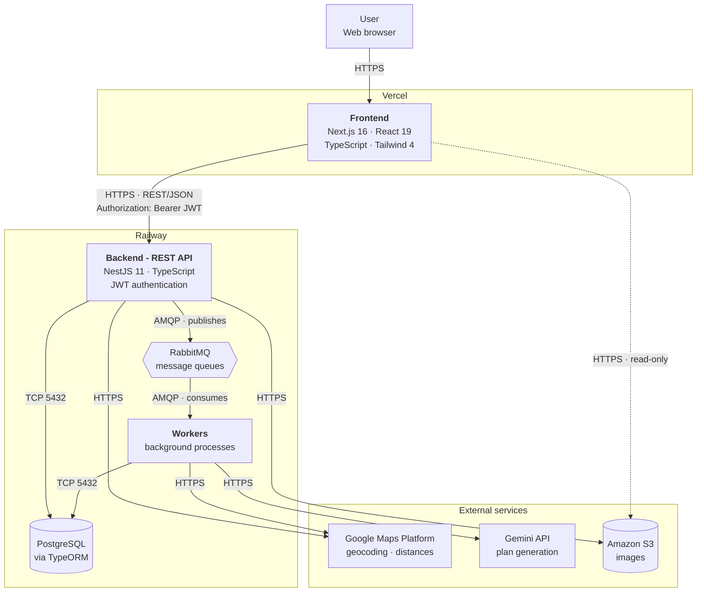

# SmartPlan - System Architecture

> Shared core. This file is identical in `SmartPlan-front` and `SmartPlan-back`.
> Replicate any change in the other repository.

## Application Type

**Responsive web application.** There is no native or hybrid mobile app; users access it through a browser on desktop and mobile devices. This aligns with the final objective and the selected stack: Next.js on the client and a REST API on the server.

## Diagram

> The dotted frontend-to-S3 line represents secondary image-reading access, not the application's main path.

## Components and Technologies

| Component | Language | Framework / engine | Responsibility |
| --- | --- | --- | --- |
| Frontend | TypeScript 5 | Next.js 16 (App Router), React 19, Tailwind CSS 4 | User interface, rendering, API consumption |
| Backend | TypeScript 5.7 | NestJS 11 | REST API, business rules, authentication, authorization |
| Database | SQL | PostgreSQL (TypeORM 0.3, `pg` driver) | Persistence for approximately 30 domain entities |
| Message queue | — | RabbitMQ | Decouples asynchronous processing from HTTP responses |
| Workers | TypeScript | NestJS consumers | Background and scheduled tasks |
| Object storage | — | Amazon S3 | Activity and place images |
| Geolocation | — | Google Maps Platform | Addresses, coordinates, activity distances |
| Plan generation | — | Gemini API | Personalized plans and suggestions |

## Communication Between Components

| Source | Destination | Protocol | Details |
| --- | --- | --- | --- |
| Browser | Frontend | HTTPS | Application rendering |
| Frontend | Backend | HTTPS, REST/JSON | JWT in `Authorization: Bearer <token>` |
| Backend | PostgreSQL | TCP 5432 | Through TypeORM; never raw SQL from a controller |
| Backend | RabbitMQ | AMQP | Publishes jobs and responds without waiting. Direct exchange `smartplan.jobs`, at-least-once delivery, up to 3 attempts, DLQ per type |
| RabbitMQ | Workers | AMQP | Workers consume and process jobs |
| Backend / Workers | Google Maps | HTTPS REST | API key through an environment variable |
| Workers | Gemini | HTTPS REST | API key through an environment variable |
| Backend | S3 | HTTPS | Image upload |
| Frontend | S3 | HTTPS | Direct image reading |

**Dependency rule:** the frontend never communicates with PostgreSQL, RabbitMQ, or Gemini. Everything it needs goes through the backend API, except reading images from S3.

## Asynchronous Processing

| Process | Trigger | Why it is asynchronous |
| --- | --- | --- |
| Plan generation (Google Maps and Gemini queries) | A user requests a plan (CU17, CU19, CU31) | External APIs have variable latency |
| Notification delivery | System events | Must not block the triggering operation |
| External activity and place data updates | Scheduled task (CU50) | High volume, with no waiting user |
| Cleanup of temporary data and expired plans | Scheduled task | Maintenance |
| Internal usage-report generation | Scheduled task (CU58) | Heavy aggregations |

None of these processes is implemented yet. F12 provides only the infrastructure and an example job; see "Implementation Status".

**Delivery semantics: at-least-once.** A job is acknowledged only after successful processing. If a worker fails midway, RabbitMQ redelivers the message, so **a job can run more than once** and handlers must tolerate that. There is no global deduplication or exactly-once delivery, and none is planned because its cost is disproportionate. Idempotency for non-repeatable effects belongs in the handler, against PostgreSQL state. RabbitMQ transports jobs; PostgreSQL maintains functional domain state.

**Retries:** up to 3 attempts per job through `RABBITMQ_MAX_ATTEMPTS`, with TTL-queue and Dead Letter Exchange delays set by `RABBITMQ_RETRY_DELAYS_MS` (default `5000,30000` milliseconds). Exhausted retries or non-retryable business errors go to a Dead Letter Queue (DLQ), the operational record of unprocessed jobs. See `docs/architecture.md` for the complete topology.

**Durability, not high availability.** Durable queues and persistent messages protect against worker/API restarts and allow AMQP to requeue a job if a worker disconnects. This **does not** provide high availability: a single RabbitMQ node, without clustering or quorum queues, can lose queued messages if the node is completely lost. Clustering is out of scope for the current project size.

## Environments

### Development - `localhost`

| Component | Runs on | Port |
| --- | --- | --- |
| Frontend | `pnpm dev` | 3000 |
| Backend | `pnpm start:dev` | 3001 |
| PostgreSQL | Docker or a local installation | 5432 |
| RabbitMQ | Docker | 5672 (management UI: 15672) |
| Google Maps / Gemini / S3 | Live services with development credentials | — |

> **Backend port.** Next.js and NestJS both default to port 3000. The environment schema resolves this by setting `PORT` to 3001 and `FRONTEND_URL` to `http://localhost:3000`, which is also the API's only CORS-allowed origin. Review both values if either changes.

### Production

| Component | Platform | Annual cost (Phase 3) |
| --- | --- | --- |
| Frontend | Vercel | US$ 0 |
| Backend + PostgreSQL | Railway | US$ 240 |
| Google Maps Platform | Google Cloud | US$ 0 |
| Gemini API | Google Cloud | US$ 120 |
| Domain | Registrar | US$ 6 |

Total infrastructure cost: **US$ 366 / year**. Deployment is continuous from GitHub: Vercel and Railway receive merged changes. `main` is the production branch.

## Environment Configuration

Everything that differs between environments uses **environment variables**, never hardcoded values.

| Variable | Location | Purpose |
| --- | --- | --- |
| `NEXT_PUBLIC_API_URL` | Frontend | API base URL |
| `DATABASE_URL` | Backend | PostgreSQL connection |
| `JWT_ACCESS_SECRET` | Backend | Access JWT signing secret |
| `JWT_REFRESH_SECRET` | Backend | Separate refresh JWT secret |
| `RESEND_API_KEY` | Backend | Password-recovery email delivery |
| `EMAIL_FROM` | Backend | Verified Resend sender |
| `RABBITMQ_URL` | Backend / Workers | Queue connection |
| `RABBITMQ_PREFETCH` | Backend / Workers | Messages a worker takes at once |
| `RABBITMQ_MAX_ATTEMPTS` | Backend / Workers | Total attempts per job, including the first |
| `RABBITMQ_RETRY_DELAYS_MS` | Backend / Workers | Comma-separated retry delays in milliseconds |
| `GOOGLE_MAPS_API_KEY` | Backend / Workers | Google Maps key |
| `GEMINI_API_KEY` | Workers | Gemini key |
| `AWS_*` | Backend | S3 credentials |

Do not commit `.env`. Keep a `.env.example` containing keys without values.

## Implementation Status

Already decided **in code**:

- Frontend: Next.js 16.2.3, React 19, Tailwind 4, in `SmartPlan-front`.
- Backend: NestJS 11, in `SmartPlan-back`.
- Database: PostgreSQL with TypeORM; `@nestjs/typeorm`, `typeorm`, and `pg` are present.
- RabbitMQ and base worker (F12, #34): queue infrastructure and a separate worker process in `src/worker.ts`. Its example job demonstrates publishing, queueing, worker consumption, acknowledgement, delayed retries, and the Dead Letter Queue. **No functional jobs exist yet**: plan generation and notifications remain planned.

Defined in documentation but not yet in code:

- Amazon S3 appears in the technical feasibility study and training plan, but has no dependencies or modules. Unlike Vercel, Railway, Google Maps, and Gemini, it is **not included in the Phase 3 cost table**.
- Functional queue jobs for plan generation (CU17/19/31), notifications, external-data synchronization, scheduled cleanup, and internal reports. F12 prepares the infrastructure, but none has been written.

The Gemini API replaces the OpenAI API anticipated by the original Phase 3 technical feasibility study. F10 (#32) validated the integration: Spanish plan generation, budget compliance, real places verifiable through Grounding with Google Maps, and a within-budget generation cost. The production integration for CU17, CU19, and CU31 is not yet written; the spike is isolated evaluation code, not the final recommendation engine. See `docs/decisions.md` for the decision details.

Before implementing any of these, verify that the decision remains valid.
